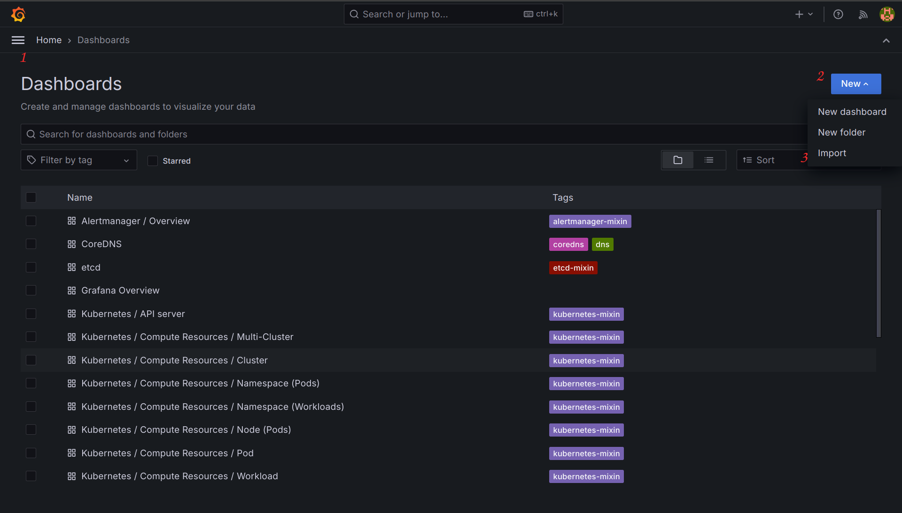
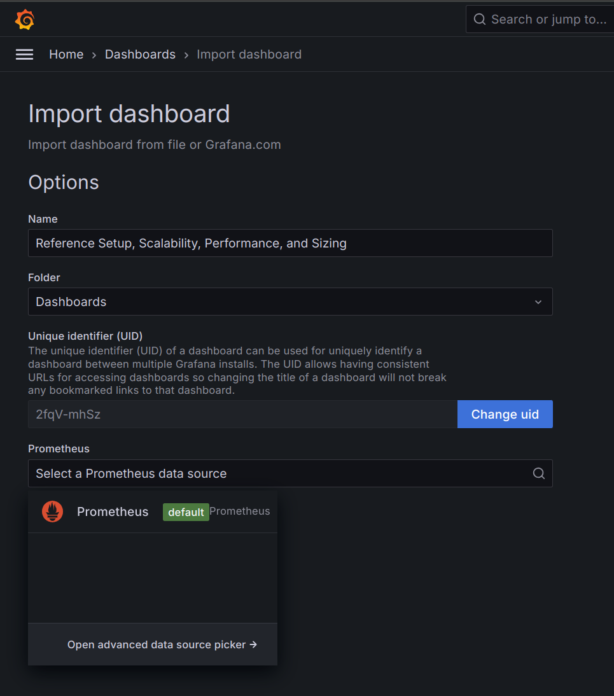
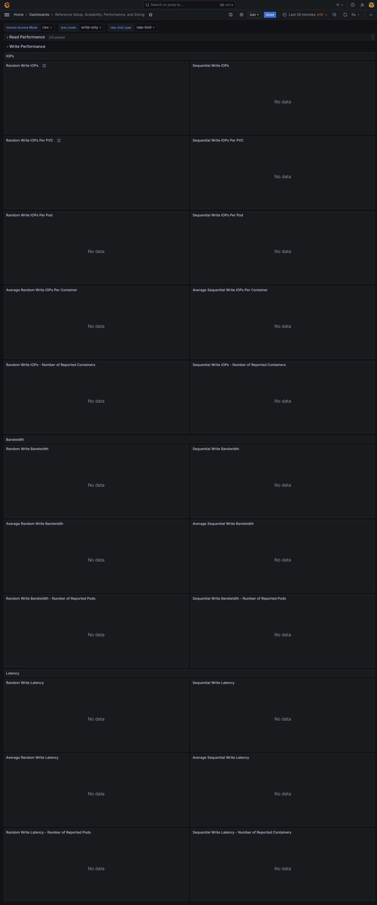
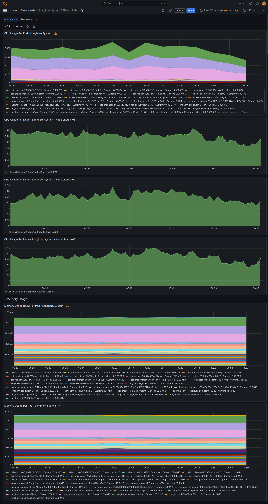

# How To Setup This Benchmark Tests

1. [Setup nodes](#setup-nodes)
1. [Setup Kubernetes](#setup-kubernetes)
1. [Setup Longhorn](#setup-longhorn)
1. [Setup Monitoring](#setup-monitoring)
1. [Perform The Tests](#perform-the-tests)
   1. [Prefill the PVC](#prefill-the-pvc)
   1. [Random Read IOPs](#random-read-iops)
   1. [Sequential Read IOPs](#sequential-read-iops)
   1. [Random Write IOPs](#random-write-iops)
   1. [Sequential Write IOPs](#sequential-write-iops)
   1. [Random Read Latency](#random-read-latency)
   1. [Sequential Read Latency](#sequential-read-iops)
   1. [Random Write Latency](#random-write-latency)
   1. [Sequential Write Latency](#sequential-write-latency)
1. [Addition Context](#addition-context)
   1. [Firewall rules](#firewall-rules)
   1. [Testing the performance of the native disk](#testing-the-performance-of-the-native-disk)
   1. [Measuring the internode network connection](#measuring-the-internode-network-connection)

In this tutorial, we will walk you through the process of setting up a similar testing environment to test the performance on your own cluster.

## Setup nodes
1. Prepare 3 nodes. For the sake of simplicity, let's call them `photon-01`, `photon-02`, and `photon-03`
1. Each node should have a root disk (for the OS and Kubelet) and a dedicated disk for Longhorn.
   Let's assume that the name of the root disk is `nvme0n1` and the name of the dedicated disk for Longhorn is `nvme1n1`
1. On each node, make an ext4 filesystem on the disk `nvme1n1` and mount it at `/longhorn`:
    ```bash
    mkfs.ext4 /dev/nvme1n1
    mkdir /longhorn
    mount /dev/nvme1n1 /longhorn/
    ```
1. Persist mount across the node reboot by doing this on each node:
    ```bash
    # Find the filesystem UUID of /dev/nvme1n1
    lsblk --fs
    # Edit the /etc/fstab
    `vim /etc/fstab`
    # Add this line to the end of /etc/fstab 
    UUID=<uuid-of-filesystem-found-above>	ext4	defaults	0	2
    ```

## Setup Kubernetes

1. Deploy Kubernetes distro of your choice on to the 3 nodes with:
   * `photon-01` has both master role + worker role
   * `photon-02` and `photon-03` have worker role
1. We use [k3s](https://github.com/k3s-io/k3s) for our test, but other distros should work


## Setup Longhorn
1. Install open-iscsi on each node by ssh into each node and run
   ```bash
   tdnf install open-iscsi -y && sudo systemctl -q enable iscsid && sudo systemctl start iscsid && systemctl status iscsid
   ```
1. Install nfs-client by
   ```bash
   kubectl apply -f https://raw.githubusercontent.com/longhorn/longhorn/v1.6.1/deploy/prerequisite/longhorn-nfs-installation.yaml
   ```
1. Create `longhorn-system` namespace
   ```bash
   kubectl create namespace longhorn-system
   ```
1. Deploy this Limit Range object into the longhorn-system namespace (Please see the original Longhorn report for why we choose this Limit Range Object).
   > Note that this is a workaround because in the current implementation of Longhorn, there is no setting to control the CPU and memory limits.
   We will improve this in the ticket https://github.com/longhorn/longhorn/issues/8333 .
   ```yaml
   apiVersion: v1
   kind: LimitRange
   metadata:
     name: resource-constraint
     namespace: longhorn-system
   spec:
     limits:
     - default: # this section defines default limits
         cpu: 1400m
         memory: 1024Mi
       defaultRequest: # this section defines default requests
         cpu: 100m
         memory: 100Mi
       type: Container
   ```
1. Create this `longhorn-helm-values.yaml` file:
   ```yaml
   defaultSettings:
     # This follow the best practice for dedicated disk https://longhorn.io/docs/1.6.1/best-practices/#minimal-available-storage-and-over-provisioning
     storageOverProvisioningPercentage: 100
     storageMinimalAvailablePercentage: 10
     # This follows the best practice at https://longhorn.io/docs/1.6.1/best-practices/#allow-volume-creation-with-degraded-availability
     allowVolumeCreationWithDegradedAvailability: false
     # Longhorn will use storage at this location on the host by default
     defaultDataPath: "/longhorn/"
     # This setting defines the CPU requests of Longhorn instance-manager pods. 
     # Because Broadcom's node has 32 CPUs, we need to set this one to 1 (meaning 1% of 32 CPUs = 320 miliCPUs). 
     # This will make sure the CPU request of instance-manager pods are smaller than CPU limit (1400 miliCPUs as defined in the Limit Range above)
     guaranteedInstanceManagerCPU: 1
   # We discovered a recent upstream nfs-ganesha bug which could make nfs mount frozen. We fixed it in the upcomming Longhorn v1.6.2 release.
   # In the meantime, you can use this image as temporary workaround. See more details at https://github.com/longhorn/longhorn/issues/8253
   image:
      longhorn:
         shareManager:
            repository: phanle1010/longhorn-share-manager
            tag: v1.6.1-fixed-nfs-frozen
   ```
1. Install Longhorn with these Helm values by:
   ```bash
   helm repo add longhorn https://charts.longhorn.io
   helm repo update
   helm install longhorn longhorn/longhorn --namespace longhorn-system --create-namespace --version 1.6.1 --values longhorn-helm-values.yaml
   ```
1. You now can play around with Longhorn UI by:
   ```bash
   kubectl port-forward services/longhorn-frontend 8080:http -n longhorn-system
   ```
   and open a browser on your local machine at http://localhost:8080 .
   Navigate to the Node tap on the UI and make verify that all node are schedulable with the correct amount of storage.

## Setup Monitoring

We use [kube-prometheus-stack](https://github.com/prometheus-community/helm-charts/blob/main/charts/kube-prometheus-stack/README.md) to collect and visualize the performance and resource usage metrics.

1. Install kube-prometheus-stack to the `monitoring` namespace by:
    ```bash
    helm repo add prometheus-community https://prometheus-community.github.io/helm-charts
    helm repo update
    # Set serviceMonitorSelectorNilUsesHelmValues=false to select all service monitors
    helm upgrade --install prometheus-stack prometheus-community/kube-prometheus-stack --namespace monitoring --create-namespace --set prometheus.prometheusSpec.serviceMonitorSelectorNilUsesHelmValues=false
    ```
   Note that you need Helm 3+
1. Forward Grafana service to your local machine by 
    ```bash
    kubectl port-forward svc/prometheus-stack-grafana  3000:80 -n monitoring
    ```
1. Access Grafana dashboard at http://localhost:3000 using default credentials: `admin/prom-operator`
1. In Grafana UI, click on the menu at top left -> go to Dashboards -> Click on `New` button on the top right -> select `Import` dashboard
   
1. Select `Upload dashboard JSON file` and upload the dashboard [longhorn_performance_grafana_dashboard.json](./longhorn_performance_grafana_dashboard.json)
1. Then select the default Prometheus as datasource:

   
1. You should have this empty graph at the moment:

   
1. Repeat the same process to import [longhorn-system-cpu-and-ram-grafana-dashboard-v2.json](./longhorn-system-cpu-and-ram-grafana-dashboard-v2.json).
   You should have this graph after this step:
   

> Note that the dashboard [longhorn-system-cpu-and-ram-grafana-dashboard-v2.json](./longhorn-system-cpu-and-ram-grafana-dashboard-v2.json) has hard-coded values for node name `photon-01`, `photon-02`, and `photon-03`. 
> If you have different node names, please go to the CPU panels and edit the queries to point to the correct node names.


## Perform The Tests

Prerequisite: deploy the 3 Longhorn PVCs:
```yaml
apiVersion: v1
kind: PersistentVolumeClaim
metadata:
  name: pvc-1
spec:
  volumeMode: Filesystem
  storageClassName: longhorn  # replace with your storage class
  accessModes:
    - ReadWriteMany
  resources:
    requests:
      storage: 2Gi
---
apiVersion: v1
kind: PersistentVolumeClaim
metadata:
  name: pvc-2
spec:
  volumeMode: Filesystem
  storageClassName: longhorn
  accessModes:
    - ReadWriteMany
  resources:
    requests:
      storage: 4Gi
---
apiVersion: v1
kind: PersistentVolumeClaim
metadata:
  name: pvc-3
spec:
  volumeMode: Filesystem
  storageClassName: longhorn
  accessModes:
    - ReadWriteMany
  resources:
    requests:
      storage: 40Gi
```
Since there is no way to control the scheduling of share-manager at the moment, we use this workaround to force all workload pods and share-manager pods to be on node `photon-02`:
```bash
kubectl cordon photon-01 photon-03
```
> Note that this limitation will be improved by this ticket https://github.com/longhorn/longhorn/issues/7872

## Prefill the PVC
Longhorn is using sparse file technology, so prefill the spare file will make the write performance more consistent.
1. Deploy this workload to prefill the PVCs
   ```bash
   kubectl apply -f https://raw.githubusercontent.com/PhanLe1010/kbench/broadcom/deploy/broadcom-workload-prefill-pvcs.yaml
   ```
1. Look into Longhorn  UI, wait for the actual size of pvc-1 is 1.69Gi, pvc-2 is 3.33Gi, pvc-3 is 32.9Gi
1. Delete the statefulset workload:
   ```bash
   kubectl delete sts test-workload
   ```
   Note that we should not delete the PVCs.

## Random Read IOPs

1. Deploy the workload 
   ```
   kubectl apply -f https://raw.githubusercontent.com/PhanLe1010/kbench/broadcom/deploy/broadcom-workload-random-read-iops.yaml
   ```
1. Run the test for 30 mins
1. Check volume performance by go to Grafana dashboard -> Reference Setup, Scalability, Performance, and Sizing -> On the top of the dashboard, select `Volume Access Mode: rwx`, `test_mode:read-only`, and `rate_limit_type: rate-limit` -> expand the `Read Performance` tab
1. You show see the random read IOPs graphs of the volumes 
1. Check CPU and RAM usage of Longhorn by go to Grafana dashboard `Longhorn System CPU and RAM`

## Sequential Read IOPs
1. Delete the statefulset workload from the previous step:
   ```bash
   kubectl delete sts test-workload
   ```
   Note that we should not delete the PVCs.
1. Deploy the workload
   ```
   kubectl apply -f https://raw.githubusercontent.com/PhanLe1010/kbench/broadcom/deploy/broadcom-workload-sequential-read-iops.yaml
   ```
1. Run the test for 30 mins
1. Check volume performance by go to Grafana dashboard -> Reference Setup, Scalability, Performance, and Sizing -> On the top of the dashboard, select `Volume Access Mode: rwx`, `test_mode:read-only`, and `rate_limit_type: rate-limit` -> expand the `Read Performance` tab
1. You show see the sequential read IOPs graphs of the volumes
1. Check CPU and RAM usage of Longhorn by go to Grafana dashboard `Longhorn System CPU and RAM`

## Random Write IOPs
1. Delete the statefulset workload from the previous step:
   ```bash
   kubectl delete sts test-workload
   ```
   Note that we should not delete the PVCs.
1. Deploy the workload
   ```
   kubectl apply -f https://raw.githubusercontent.com/PhanLe1010/kbench/broadcom/deploy/broadcom-workload-random-write-iops.yaml
   ```
1. Run the test for 30 mins
1. Check volume performance by go to Grafana dashboard -> Reference Setup, Scalability, Performance, and Sizing -> On the top of the dashboard, select `Volume Access Mode: rwx`, `test_mode:write-only`, and `rate_limit_type: rate-limit` -> expand the `Write Performance` tab
1. You show see the random write IOPs graphs of the volumes
1. Check CPU and RAM usage of Longhorn by go to Grafana dashboard `Longhorn System CPU and RAM`

## Sequential Write IOPs
1. Delete the statefulset workload from the previous step:
   ```bash
   kubectl delete sts test-workload
   ```
   Note that we should not delete the PVCs.
1. Deploy the workload
   ```
   kubectl apply -f https://raw.githubusercontent.com/PhanLe1010/kbench/broadcom/deploy/broadcom-workload-sequential-write-iops.yaml
   ```
1. Run the test for 30 mins
1. Check volume performance by go to Grafana dashboard -> Reference Setup, Scalability, Performance, and Sizing -> On the top of the dashboard, select `Volume Access Mode: rwx`, `test_mode:write-only`, and `rate_limit_type: rate-limit` -> expand the `Write Performance` tab
1. You show see the sequential write IOPs graphs of the volumes
1. Check CPU and RAM usage of Longhorn by go to Grafana dashboard `Longhorn System CPU and RAM`

## Random Read Latency
1. Delete the statefulset workload from the previous step:
   ```bash
   kubectl delete sts test-workload
   ```
   Note that we should not delete the PVCs.
1. Deploy the workload
   ```
   kubectl apply -f https://raw.githubusercontent.com/PhanLe1010/kbench/broadcom/deploy/broadcom-workload-random-read-latency.yaml
   ```
   > Note that there is only one container reading/writing each PVC similar to what we have in the initial report
1. Run the test for 30 mins
1. Check volume performance by go to Grafana dashboard -> Reference Setup, Scalability, Performance, and Sizing -> On the top of the dashboard, select `Volume Access Mode: rwx`, `test_mode:read-only`, and `rate_limit_type: rate-limit` -> expand the `Read Performance` tab
1. You show see the random read latency graphs of the volumes
1. Check CPU and RAM usage of Longhorn by go to Grafana dashboard `Longhorn System CPU and RAM`

## Sequential Read Latency
1. Delete the statefulset workload from the previous step:
   ```bash
   kubectl delete sts test-workload
   ```
   Note that we should not delete the PVCs.
1. Deploy the workload
   ```
   kubectl apply -f https://raw.githubusercontent.com/PhanLe1010/kbench/broadcom/deploy/broadcom-workload-sequential-read-latency.yaml
   ```
   > Note that there is only one container reading/writing each PVC similar to what we have in the initial report
1. Run the test for 30 mins
1. Check volume performance by go to Grafana dashboard -> Reference Setup, Scalability, Performance, and Sizing -> On the top of the dashboard, select `Volume Access Mode: rwx`, `test_mode:read-only`, and `rate_limit_type: rate-limit` -> expand the `Read Performance` tab
1. You show see the sequential read latency graphs of the volumes
1. Check CPU and RAM usage of Longhorn by go to Grafana dashboard `Longhorn System CPU and RAM`

## Random Write Latency
1. Delete the statefulset workload from the previous step:
   ```bash
   kubectl delete sts test-workload
   ```
   Note that we should not delete the PVCs.
1. Deploy the workload
   ```
   kubectl apply -f https://raw.githubusercontent.com/PhanLe1010/kbench/broadcom/deploy/broadcom-workload-random-write-latency.yaml
   ```
   > Note that there is only one container reading/writing each PVC similar to what we have in the initial report
1. Run the test for 30 mins
1. Check volume performance by go to Grafana dashboard -> Reference Setup, Scalability, Performance, and Sizing -> On the top of the dashboard, select `Volume Access Mode: rwx`, `test_mode:write-only`, and `rate_limit_type: rate-limit` -> expand the `Write Performance` tab
1. You show see the random write latency graphs of the volumes
1. Check CPU and RAM usage of Longhorn by go to Grafana dashboard `Longhorn System CPU and RAM`

## Sequential Write Latency
1. Delete the statefulset workload from the previous step:
   ```bash
   kubectl delete sts test-workload
   ```
   Note that we should not delete the PVCs.
1. Deploy the workload
   ```
   kubectl apply -f https://raw.githubusercontent.com/PhanLe1010/kbench/broadcom/deploy/broadcom-workload-sequential-write-latency.yaml
   ```
   > Note that there is only one container reading/writing each PVC similar to what we have in the initial report
1. Run the test for 30 mins
1. Check volume performance by go to Grafana dashboard -> Reference Setup, Scalability, Performance, and Sizing -> On the top of the dashboard, select `Volume Access Mode: rwx`, `test_mode:write-only`, and `rate_limit_type: rate-limit` -> expand the `Write Performance` tab
1. You show see the sequential write latency graphs of the volumes
1. Check CPU and RAM usage of Longhorn by go to Grafana dashboard `Longhorn System CPU and RAM`


## Addition Context
### Firewall rules
Photon OS is pretty strict with the default firewall settings. If you run into networking issue, please double-check the default iptables settings
### Testing the performance of the native disk
You might want to double-check the performance of the host disk at `/longhorn` to see if it is fast enough. You can do it quickly using Kbench:
```bash
tdnf install fio -y && tdnf install jq -y && tdnf install git -y
git clone https://github.com/longhorn/kbench.git 
./kbench/fio/run.sh /longhorn/test.img
```
> Note: only do this when not running Longhorn tests because it might affect performance of these tests
### Measuring the internode network connection
You might want to double-check the inter-node network performance to see if they are at least 10 Gbps using [iperf](https://iperf.fr/)

